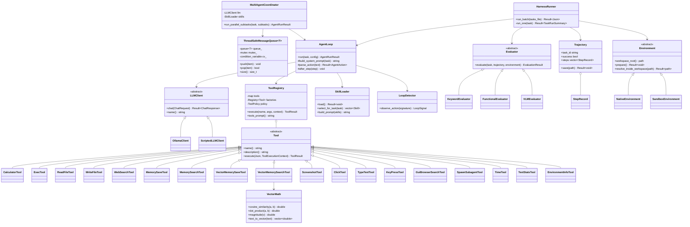
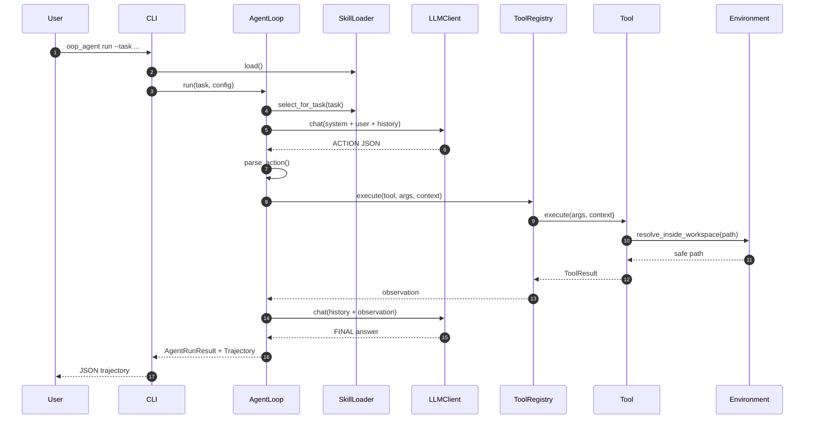
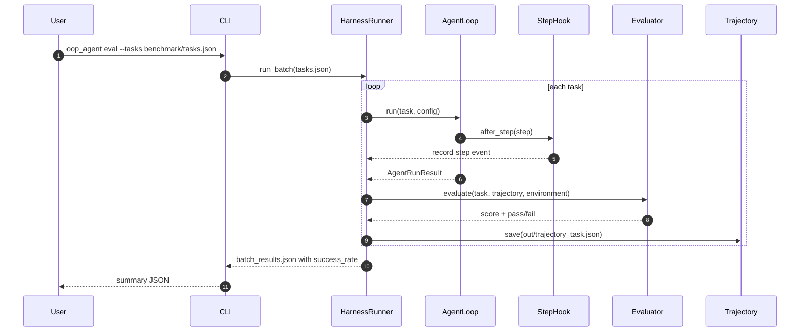
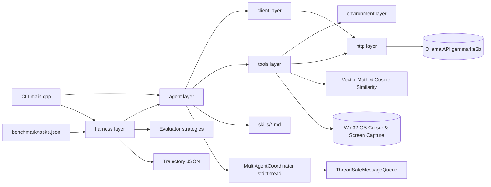

# UML Diagrams

## 1. Class Diagram

```mermaid
classDiagram
    class LLMClient {
      <<abstract>>
      +chat(ChatRequest) Result~ChatResponse~
      +name() string
    }
    class OllamaClient
    class ScriptedLLMClient
    LLMClient <|-- OllamaClient
    LLMClient <|-- ScriptedLLMClient

    class Tool {
      <<abstract>>
      +name() string
      +description() string
      +execute(Json, ToolExecutionContext) ToolResult
    }
    Tool <|-- CalculatorTool
    Tool <|-- ExecTool
    Tool <|-- ReadFileTool
    Tool <|-- WriteFileTool
    Tool <|-- WebSearchTool
    Tool <|-- MemorySaveTool
    Tool <|-- MemorySearchTool
    Tool <|-- VectorMemorySaveTool
    Tool <|-- VectorMemorySearchTool
    Tool <|-- ScreenshotTool
    Tool <|-- ClickTool
    Tool <|-- TypeTextTool
    Tool <|-- KeyPressTool
    Tool <|-- GuiBrowserSearchTool
    Tool <|-- SpawnSubagentTool
    Tool <|-- TimeTool
    Tool <|-- TextStatsTool
    Tool <|-- EnvironmentInfoTool

    class VectorMath {
      +cosine_similarity(a, b) double
      +dot_product(a, b) double
      +magnitude(v) double
      +text_to_vector(text) vector~double~
    }
    VectorMemorySearchTool --> VectorMath

    class ToolRegistry {
      -map tools
      -Registry~Tool~ factories
      -ToolPolicy policy
      +execute(name, args, context) ToolResult
      +tools_prompt() string
    }
    ToolRegistry o-- Tool

    class SkillLoader {
      +load() Result~void~
      +select_for_task(task) vector~Skill~
      +build_prompt(skills) string
    }
    class LoopDetector {
      +observe_action(signature) LoopSignal
    }
    class AgentLoop {
      +run(task, config) AgentRunResult
      #build_system_prompt(task) string
      #parse_action(text) Result~AgentAction~
      #after_step(step) void
    }
    AgentLoop --> LLMClient
    AgentLoop --> ToolRegistry
    AgentLoop --> SkillLoader
    AgentLoop --> LoopDetector

    class ThreadSafeMessageQueue~T~ {
      -queue~T~ queue_
      -mutex mutex_
      -condition_variable cv_
      +push(item) void
      +pop(item) bool
      +size() size_t
    }

    class MultiAgentCoordinator {
      -LLMClient llm
      -SkillLoader skills
      +run_parallel_subtasks(task, subtasks) AgentRunResult
    }
    MultiAgentCoordinator --> ThreadSafeMessageQueue~T~
    MultiAgentCoordinator --> AgentLoop

    class Environment {
      <<abstract>>
      +workspace_root() path
      +prepare() Result~void~
      +resolve_inside_workspace(path) Result~path~
    }
    Environment <|-- NativeEnvironment
    Environment <|-- SandboxEnvironment

    class Evaluator {
      <<abstract>>
      +evaluate(task, trajectory, environment) EvaluationResult
    }
    Evaluator <|-- KeywordEvaluator
    Evaluator <|-- FunctionalEvaluator
    Evaluator <|-- VLMEvaluator

    class Trajectory {
      +task_id string
      +success bool
      +steps vector~StepRecord~
      +save(path) Result~void~
    }
    Trajectory o-- StepRecord

    class HarnessRunner {
      +run_batch(tasks_file) Result~Json~
      -run_one(task) Result~TaskRunSummary~
    }
    HarnessRunner --> AgentLoop
    HarnessRunner --> Evaluator
    HarnessRunner --> Trajectory
    HarnessRunner --> Environment
```

## 2. Agent Run Sequence Diagram

```mermaid
sequenceDiagram
    autonumber
    participant User
    participant CLI
    participant AgentLoop
    participant SkillLoader
    participant LLMClient
    participant ToolRegistry
    participant Tool
    participant Environment

    User->>CLI: oop_agent run --task ...
    CLI->>SkillLoader: load()
    CLI->>AgentLoop: run(task, config)
    AgentLoop->>SkillLoader: select_for_task(task)
    AgentLoop->>LLMClient: chat(system + user + history)
    LLMClient-->>AgentLoop: ACTION JSON
    AgentLoop->>AgentLoop: parse_action()
    AgentLoop->>ToolRegistry: execute(tool, args, context)
    ToolRegistry->>Tool: execute(args, context)
    Tool->>Environment: resolve_inside_workspace(path)
    Environment-->>Tool: safe path
    Tool-->>ToolRegistry: ToolResult
    ToolRegistry-->>AgentLoop: observation
    AgentLoop->>LLMClient: chat(history + observation)
    LLMClient-->>AgentLoop: FINAL answer
    AgentLoop-->>CLI: AgentRunResult + Trajectory
    CLI-->>User: JSON trajectory
```

## 3. Batch Evaluation Sequence Diagram

```mermaid
sequenceDiagram
    autonumber
    participant User
    participant CLI
    participant HarnessRunner
    participant AgentLoop
    participant StepHook
    participant Evaluator
    participant Trajectory

    User->>CLI: oop_agent eval --tasks benchmark/tasks.json
    CLI->>HarnessRunner: run_batch(tasks.json)
    loop each task
        HarnessRunner->>AgentLoop: run(task, config)
        AgentLoop->>StepHook: after_step(step)
        StepHook-->>HarnessRunner: record step event
        AgentLoop-->>HarnessRunner: AgentRunResult
        HarnessRunner->>Evaluator: evaluate(task, trajectory, environment)
        Evaluator-->>HarnessRunner: score + pass/fail
        HarnessRunner->>Trajectory: save(out/trajectory_task.json)
    end
    HarnessRunner-->>CLI: batch_results.json with success_rate
    CLI-->>User: summary JSON
```

## 4. Component Diagram

```mermaid
flowchart LR
    CLI[CLI main.cpp] --> Agent[agent layer]
    CLI --> Harness[harness layer]
    Agent --> Client[client layer]
    Agent --> Tools[tools layer]
    Agent --> Skills[skills/*.md]
    Tools --> Env[environment layer]
    Tools --> HTTP[http layer]
    Tools --> VectorMath[Vector Math & Cosine Similarity]
    Agent --> MultiAgent[MultiAgentCoordinator std::thread]
    MultiAgent --> Queue[ThreadSafeMessageQueue]
    Harness --> Agent
    Harness --> Eval[Evaluator strategies]
    Harness --> Traj[Trajectory JSON]
    Client --> HTTP
    HTTP --> Ollama[(Ollama API gemma4:e2b)]
    Tools --> GUI[(Win32 OS Cursor & Screen Capture)]
    Benchmark[benchmark/tasks.json] --> Harness
```
